<p align="center">
  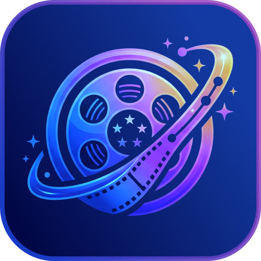
</p>

# 🎬 Movie Verse

**Movie Verse** is a high-performance, cinematic media discovery platform built with Flutter. It combines real-time data from TMDB with a premium glassmorphic UI to provide an immersive browsing experience for both Movies and TV Shows.

---

## 🌟 Key Features

- **Premium Discovery**: Explore trending, popular, and top-rated media with a high-impact, glassmorphic UI.
- **Firebase Authentication**: Secure user accounts with Email/Password and Google Sign-In integration.
- **Profile Management**: Personalize your profile with custom bios and profile pictures (Cloud Persisted).
- **Intelligent Recommendations**: Dedicated "For You" dashboard that suggests content based on your watchlist and preferences.
- **Advanced Filtering**: Discover content by Genre, Country, Year, and Rating using a unified filtering engine.
- **Unified Media Search**: Fast, real-time search across the entire TMDB database.
- **Media Details Navigation**: Tap Similar Content to jump to that title’s details seamlessly.
- **Clean Architecture**: Built using a modular GetX-based architecture for scalability and maintainability.

---

## 🛠️ Tech Stack

- **Frontend**: Flutter
- **Backend/Auth**: Firebase (Core, Auth)
- **State Management**: GetX
- **Networking**: Dio (TMDB API v3)
- **Local Database**: Hive
- **Animations**: Flutter Animate / Animate Do
- **Architecture**: Clean Architecture (Data, Domain, Presentation)

---

## 📘 Documentation

To learn more about the project's strategy and technical requirements, explore the dedicated documentation files:

| Document | Description |
| :--- | :--- |
| [**Product Requirements (PRD)**](docs/PRD.md) | High-level goals, target audience, and feature roadmap. |
| [**Technical Specification (SRS)**](docs/SRS.md) | Technical architecture, data models, and functional requirements. |

---

## 🚀 Getting Started

### Prerequisites

- Flutter SDK (latest stable)
- TMDB API Key

### Installation

1. Clone the repository:
   ```bash
   git clone https://github.com/nisanray/movieVerse.git
   ```

2. Install dependencies:
   ```bash
   flutter pub get
   ```

3. Add your TMDB API Key in `lib/core/api/api_client.dart`.

4. Run the app:
   ```bash
   flutter run
   ```

---

## 📸 Screen Gallery

### 🚀 Onboarding & Login
<table width="100%">
  <tr>
    <td align="left" width="33.33%">Onboarding<br>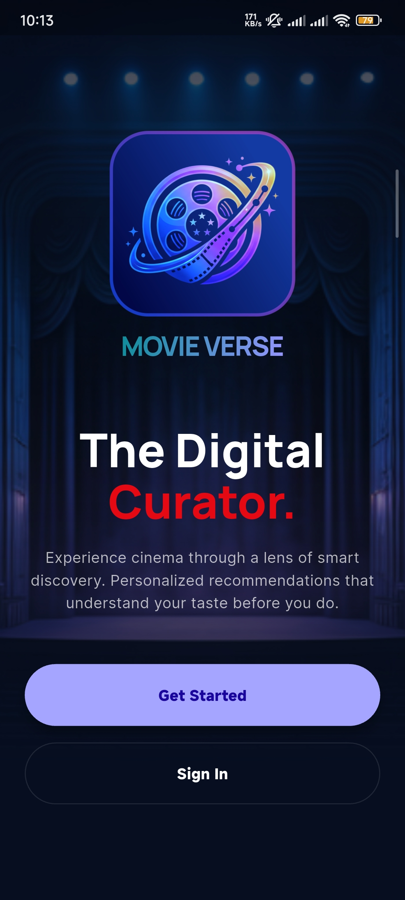</td>
    <td align="left" width="33.33%">Login<br>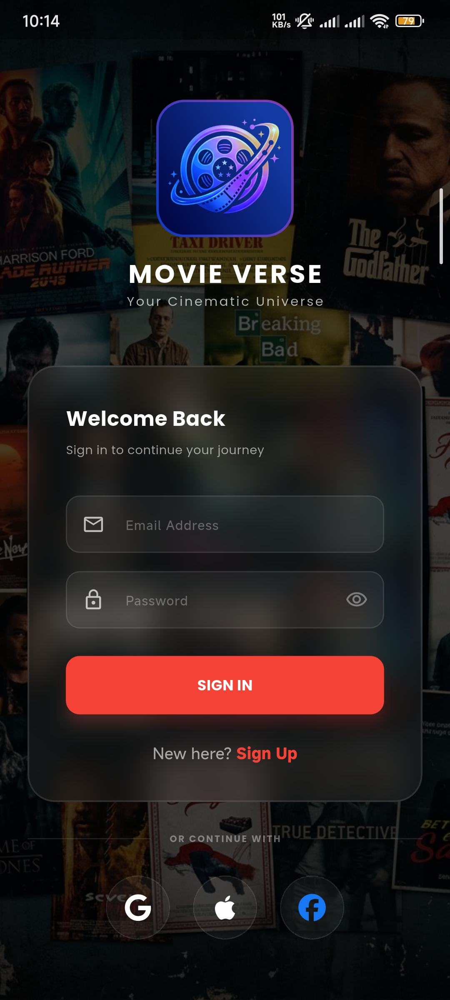</td>
    <td width="33.33%"></td>
  </tr>
</table>

### 🎬 Media Discovery Engine
<table width="100%">
  <tr>
    <td align="left" width="33.33%">Movies (Home)<br>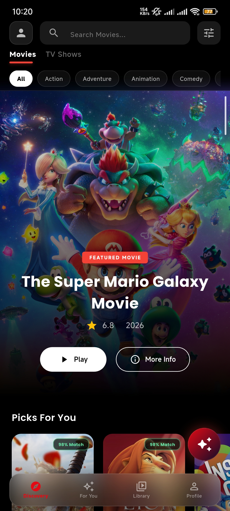</td>
    <td align="left" width="33.33%">TV Shows (Home)<br>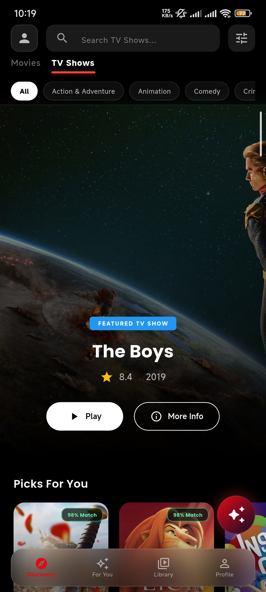</td>
    <td align="left" width="33.33%">Discovery Filters<br>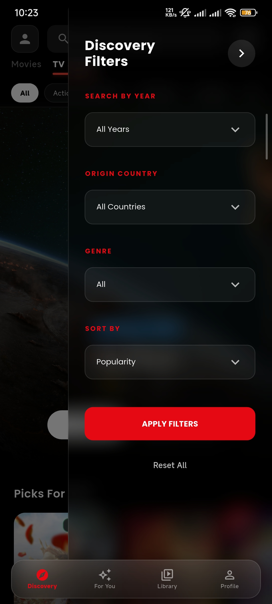</td>
  </tr>
</table>

### 🤖 AI Movie Scout
<table width="100%">
  <tr>
    <td align="left" width="33.33%">Conversational Search<br>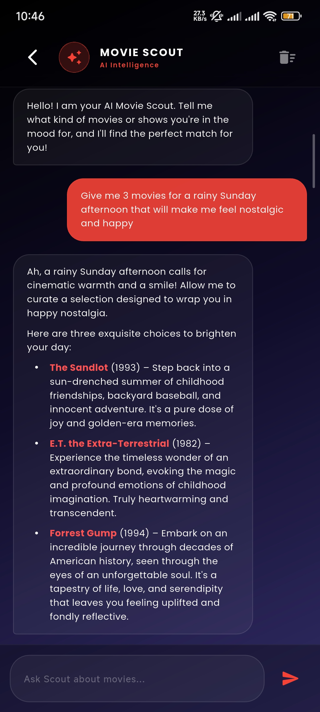</td>
    <td align="left" width="33.33%">Multi-lingual Support<br>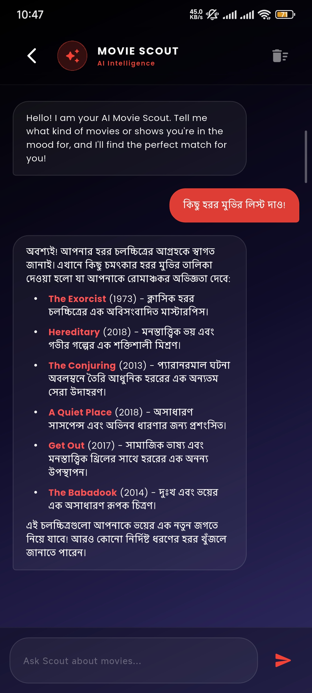</td>
    <td width="33.33%"></td>
  </tr>
</table>

### ✨ Intelligent Recommendations
<table width="100%">
  <tr>
    <td align="left" width="33.33%">For You Dashboard<br>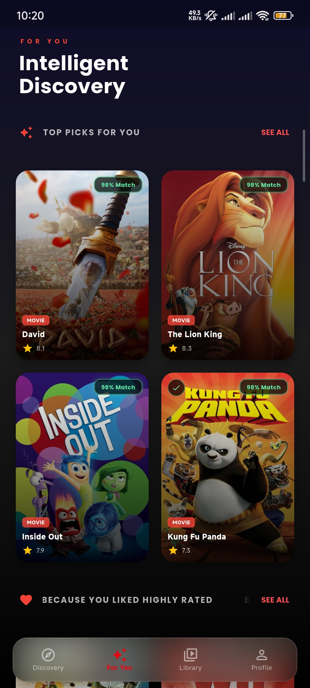</td>
    <td align="left" width="33.33%">Personalized Feed<br>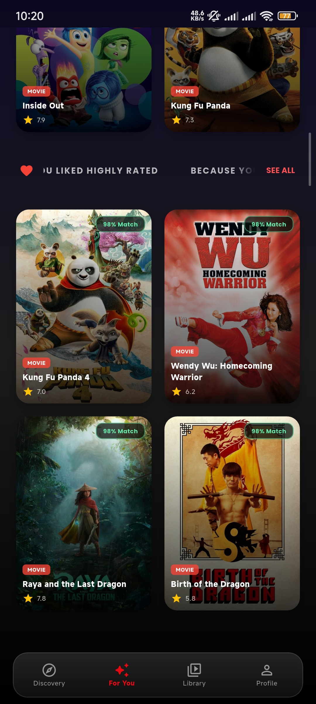</td>
    <td width="33.33%"></td>
  </tr>
</table>

### 🔍 Detailed Insights
<table width="100%">
  <tr>
    <td align="left" width="33.33%">Media Overview<br>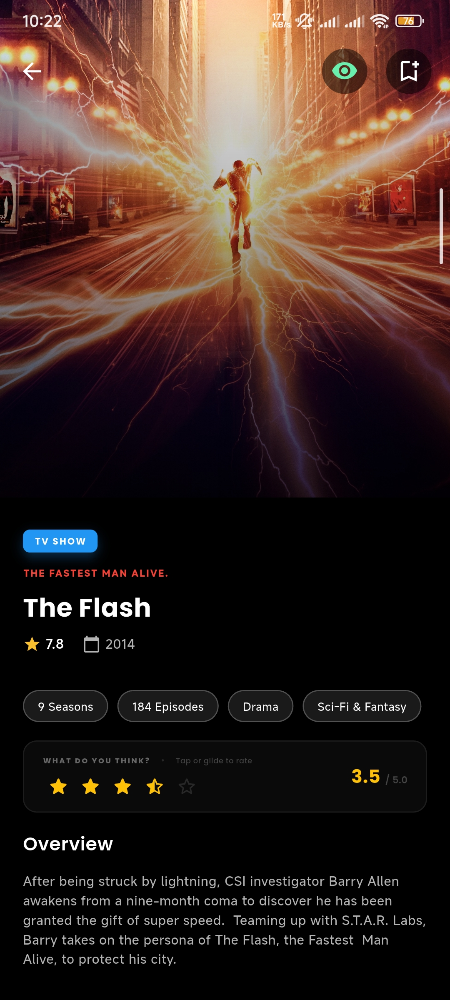</td>
    <td align="left" width="33.33%">Cast & Where to Watch<br>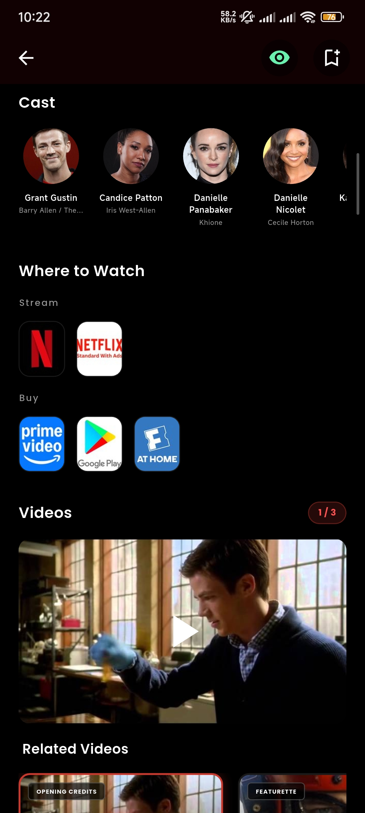</td>
    <td align="left" width="33.33%">Similar Content<br>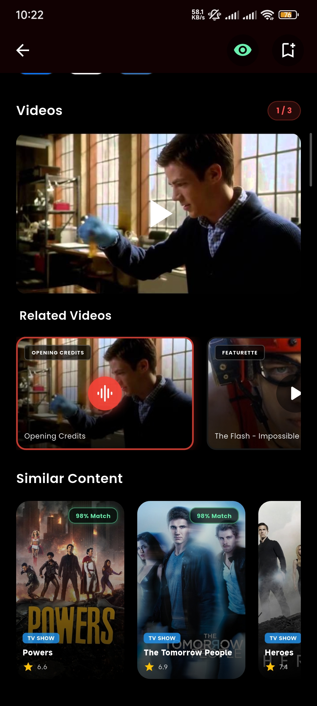</td>
  </tr>
</table>

### 🎭 Discovery Feeds & Actors
<table width="100%">
  <tr>
    <td align="left" width="33.33%">Movie Discovery Feed<br>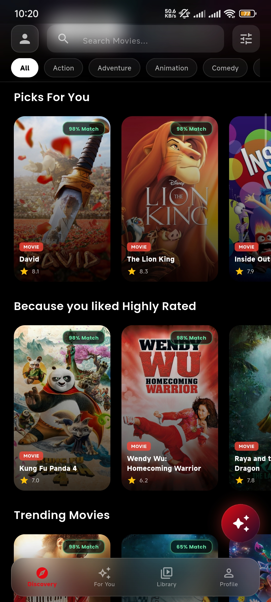</td>
    <td align="left" width="33.33%">TV Discovery Feed<br>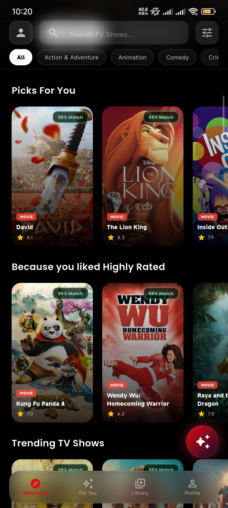</td>
    <td align="left" width="33.33%">Actor Discovery<br>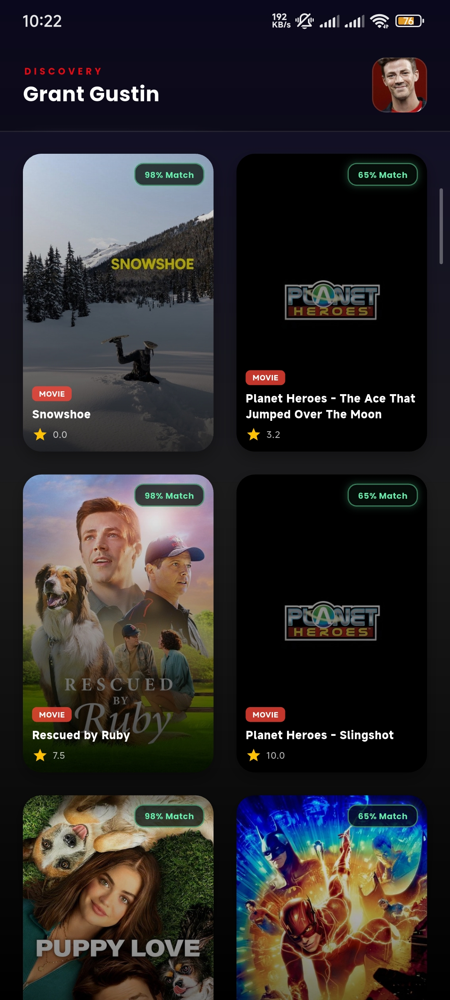</td>
  </tr>
</table>

### 📖 Library & Profile
<table width="100%">
  <tr>
    <td align="left" width="33.33%">Watch Later<br>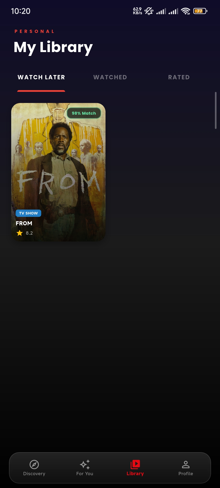</td>
    <td align="left" width="33.33%">Watched Collection<br>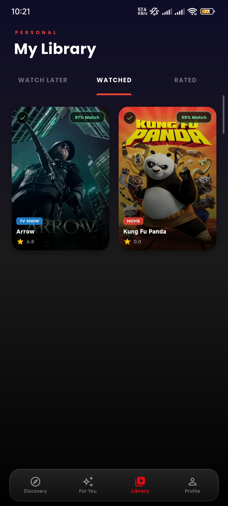</td>
    <td align="left" width="33.33%">My Ratings<br>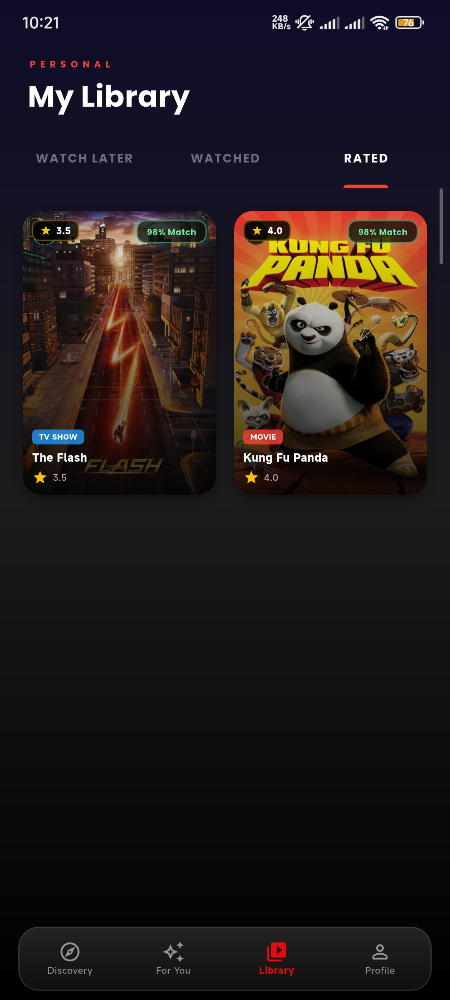</td>
  </tr>
  <tr>
    <td align="left" width="33.33%">User Profile<br>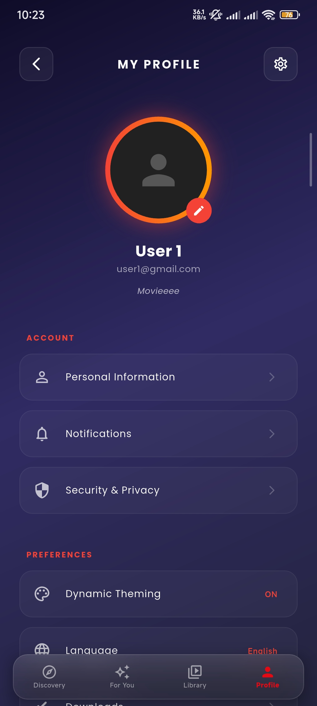</td>
    <td align="left" width="33.33%">Edit Profile Settings<br>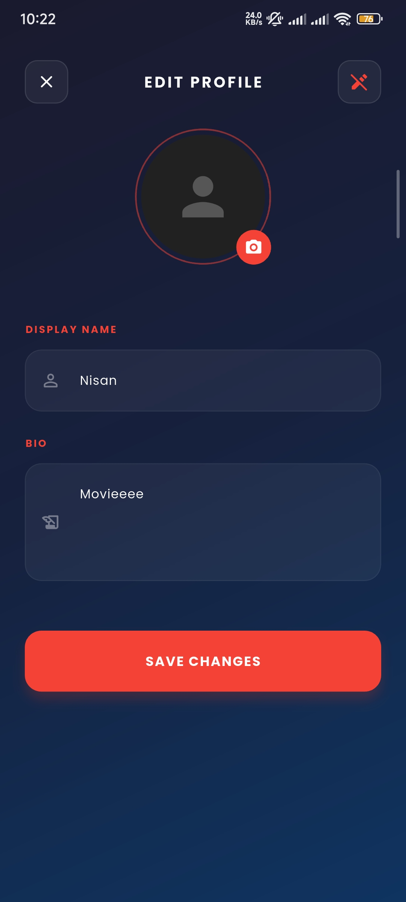</td>
    <td width="33.33%"></td>
  </tr>
</table>

---

## 🤝 Contributing

Contributions are welcome! Please feel free to submit a Pull Request.

---

## 📄 License

This project is licensed under the MIT License - see the LICENSE file for details.
