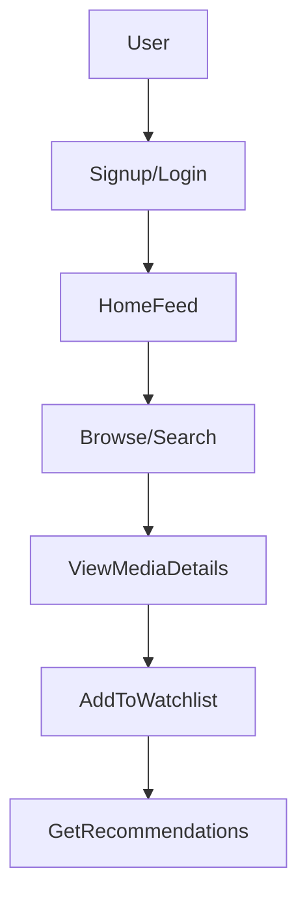

# 📘 PRODUCT REQUIREMENTS DOCUMENT (PRD)

## 1. Product Overview

**Movie Verse** is a mobile application that enables users to:

* Discover movies and TV shows via TMDB
* Receive personalized recommendations
* Manage watchlists and viewing status
* Access rich media (posters, trailers, cast)

---

## 2. Product Vision

To create a **personalized movie discovery ecosystem** that combines:

* Real-time content (API-driven)
* User-centric recommendations
* Seamless cross-device experience

---

## 3. Objectives

### 🎯 Business / Academic Objectives

* Demonstrate full-stack capability (API + backend)
* Showcase recommendation system design
* Deliver production-level UI/UX

### 📊 Success Metrics

* API response handling efficiency
* User data persistence accuracy
* Recommendation relevance
* App performance (smooth UI)

---

## 4. Target Audience

* Movie enthusiasts
* Students / developers (portfolio showcase)
* Users seeking personalized content discovery

---

## 5. Key Features

### 🔍 5.1 Media Discovery

* Trending, Popular, Top Rated content
* Search functionality
* Category-based browsing

---

### 🎬 5.2 Media Details

* Poster & backdrop
* Rating & genres
* Overview
* Cast & crew
* Trailer (YouTube integration)

---

### ❤️ 5.3 Watchlist Management

* Add/remove media
* Mark as watched/unwatched
* Persistent storage (cloud backend)

---

### 🧠 5.4 Smart Recommendation Engine

* Based on:

  * User watchlist
  * Viewing behavior
  * Genre preferences

* Powered by:

  * TMDB `/similar`
  * TMDB `/discover`

---

### 🔐 5.5 Authentication & Profile

* Email/password login
* Optional OAuth (Google)
* **Profile Management**: Custom bio and profile picture (Cloud Persisted).

---

### 💾 5.6 Offline Caching

* Cache media lists
* Store recent searches
* Improve performance

---

## 6. User Journey

---

## 7. MVP Scope

### ✅ Included

* TMDB API integration
* Home (Trending/Popular)
* Search
* Media details
* Watchlist (local + backend)
* Basic recommendation system (Similar Content)
* Profile Management (Phase 1)

### ❌ Excluded (Future Scope)

* Social features (comments, sharing)
* Advanced AI recommendation
* Multi-profile system

---

## 8. Risks & Mitigation

| Risk               | Mitigation               |
| ------------------ | ------------------------ |
| API rate limits    | Implement caching (Hive) |
| Slow network       | Loading states + retry   |
| Data inconsistency | Sync logic with backend  |

---

## 9. Project Roadmap

### 📦 Phase 1: Cloud Synergy [COMPLETED]
* Real-time Watchlist persistence via Firestore.
* Profile Management (Bio, Photo stub).
* Unified Media Architecture.

### 🚀 Phase 2: Intelligent Discovery [COMPLETED]
* Dedicated "For You" Recommendations Dashboard (Personalized Picks, Similar Content).
* Global Bottom Navigation System (4 tabs: Discovery, For You, Library, Profile).
* Advanced Genre-based Preference Engine (Genre scoring, Match %, Weighted preferences from watchlist/ratings).

### 🎭 Phase 3: Immersive Experience [IN PROGRESS]
* Enhanced Trailer Player features (Basic YouTube player exists, needs enhancements).
* Social Sharing integrations (Placeholder exists, needs full implementation).

---

## 10. Current Feature Status & Next Priorities

### ✅ Fully Implemented Features
- **Authentication**: Email/password login, Google Sign-In integration
- **Media Discovery**: Trending, Popular, Top-Rated content, Search functionality
- **Media Details**: Poster, backdrop, rating, overview, cast, trailer (YouTube)
- **Watchlist Management**: Add/remove media, mark as watched/unwatched, Firestore persistence
- **Recommendations Engine**: Genre-based scoring, match percentages, personalized picks, similar content
- **Profile Management**: Custom bio, profile picture (cloud persisted)
- **Bottom Navigation**: 4-tab navigation (Discovery, For You, Library, Profile)
- **AI Scout**: Full implementation for intelligent content discovery
- **Ratings**: Full rating system implementation

### ⚠️ Partially Implemented Features
- **Trailer Player**: Basic YouTube player exists in media_details_page.dart
  - Needs: Full-screen mode, playback quality options, picture-in-picture, related trailers
- **Social Sharing**: Placeholder page exists (social_page.dart)
  - Needs: Share to social media, friend recommendations, comments, reviews

### ❌ Stub/Placeholder Features
- **Downloads**: Placeholder page exists (downloads_page.dart)
  - Needs: Offline download functionality, download management

### 🎯 Next Development Priorities

**Priority 1: Complete Phase 3**
1. Implement full Social Sharing features
2. Enhance Trailer Player with advanced features

**Priority 2: Complete Stub Features**
3. Implement Downloads feature for offline viewing
4. Expand Social features beyond sharing

**Priority 3: Enhancements**
5. Implement local caching (FR6 from SRS)
6. Advanced filtering improvements
7. Multi-device sync optimization

