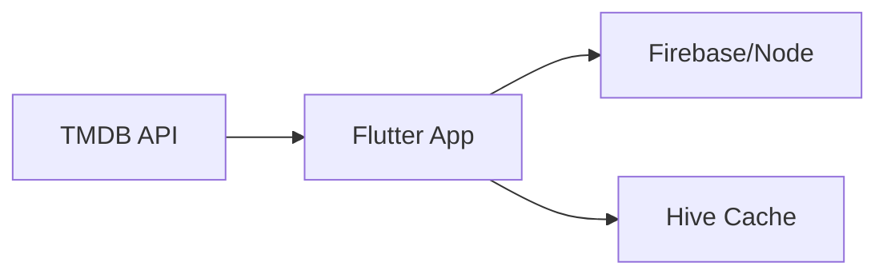

# 📗 SOFTWARE REQUIREMENTS SPECIFICATION (SRS)

---

## 1. Introduction

### 1.1 Purpose

This SRS defines functional and non-functional requirements for **Movie Verse**, ensuring clarity in system design and implementation.

---

### 1.2 Scope

Movie Verse is a mobile application integrating:

* External API (TMDB)
* Backend services (Firebase / Node.js)
* Local caching system

---

## 2. System Overview

### 2.1 System Architecture



---

## 3. Functional Requirements

---

### FR1: User Authentication

* Users shall be able to register/login/logout
* System shall maintain session persistence

---

### FR2: Movie Retrieval

* System shall fetch:

  * Trending movies
  * Popular movies
  * Search results
* Data shall be displayed in list/grid format

---

### FR3: Movie Details Display

* System shall display:

  * Title
  * Poster
  * Rating
  * Overview
  * Cast
  * Trailer

---

### FR4: Watchlist Management

* Users shall:

  * Add/remove movies
  * Mark as watched/unwatched
* Data shall be stored in backend

---

### FR5: Recommendation Engine

* System shall:

  * Analyze user preferences
  * Fetch recommendations via TMDB
  * Display personalized content

---

### FR6: Local Caching

* System shall:

  * Cache API responses using local storage
  * Reduce redundant API calls

---

## 4. Non-Functional Requirements

---

### 4.1 Performance

* API response time < 2 seconds
* Smooth scrolling (60 FPS)

---

### 4.2 Security

* Secure authentication
* API key protection

---

### 4.3 Usability

* Intuitive UI
* Minimal navigation steps

---

### 4.4 Reliability

* Graceful error handling
* Offline support via caching

---

## 5. External Interfaces

### 5.1 API Interface

* TMDB REST API

### 5.2 Backend Interface

* Firebase Auth
* Firestore / REST backend

---

## 6. Data Model

```json
User {
  "userId": "string",
  "email": "string",
  "preferences": ["genreIds"],
  "watchlist": [
    {
      "movieId": "int",
      "watched": "boolean",
      "addedAt": "timestamp"
    }
  ]
}
```

---

## 7. Constraints

* Requires internet for API calls
* TMDB API usage policies must be followed
* Mobile device performance limitations

---

## 8. Future Enhancements

* AI-based recommendation system
* Social features (reviews, ratings)
* Multi-device sync optimization
